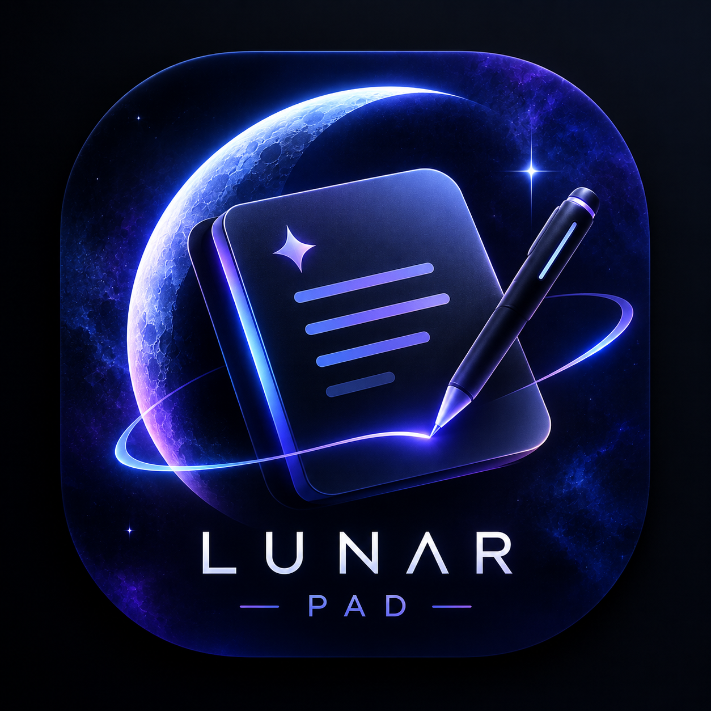

# Lunar Pad

A local-first notepad with every note kept as a tab down the left side.
Everything saves as you type — there is no Save button, and nothing leaves
your computer.

Rebuilt from the ground up in Rust. The application core is Rust; the window is
rendered by your system's webview.



## Download

**[Latest release](https://github.com/shahittoshariear-spec/zen-notepad/releases/latest)**

| File | Size | |
| --- | --- | --- |
| `LunarPad-Setup-*.exe` | 1.7 MB | Installs properly — Start Menu entry and an uninstaller. **Most people want this one.** |
| `LunarPad.exe` | 6.4 MB | Portable. Put it anywhere and double-click it. |

Both are Windows x64 and need the **WebView2 runtime**, which is already part of
Windows 10 and 11. No Node, no .NET, no Visual C++ redistributable. Build
artifacts are deliberately not committed to this repository — see
[Releasing](#releasing).

## Why Rust

The previous build ran on Electron, which meant shipping a whole browser and a
Node runtime — around 180 MB installed. Lunar Pad is a Tauri application: the
Rust binary is **6.7 MB**, and it uses the WebView2 runtime Windows already has.

More importantly, the parts that matter are now actual Rust rather than
JavaScript:

| Concern | Where it lives |
| --- | --- |
| Reading and writing notes | `src-tauri/src/store.rs` |
| Search ranking and query parsing | `src-tauri/src/search.rs` |
| Export (HTML → Markdown/plain text) | `src-tauri/src/export.rs` |
| The command surface | `src-tauri/src/commands.rs` |
| Interface | `ui/` (HTML, CSS, ES modules) |

Storage, search, export and window management are all in Rust. The webview holds
no state of its own beyond the editing session.

## What is new

**Features**

- **Command palette** (`Ctrl+K`) — one list over every note and every action,
  fuzzy-matched, so the keyboard is always the fastest route.
- **Find and replace** (`Ctrl+F`) inside the open note, with live match
  highlighting, replace-one and replace-all.
- **Trash with undo** — deleting is always reversible. Notes are restorable
  from the trash, and purged automatically after an interval you choose.
- **Tags** — add `#tags` to a note, then search `#tag` to filter by them.
  Search supports quoted phrases and `-exclusions` too.
- **Slash menu** (`/` at the start of a line) — headings, lists, quotes, code
  blocks, dividers, dates, times, word counts.
- **Focus mode** and **typewriter scrolling** for distraction-free work.
- **Export** any note or every note as Markdown, plain text, HTML or JSON, and
  import a backup back in.
- **Automatic backups** — a snapshot is taken on every launch and pruned to the
  last twelve; you can also take one on demand.
- **Per-note fonts**, adjustable text size, line spacing and column width.
- **Statistics** — word count, characters and reading time.

**Animations**

- A drifting starfield behind the interface, tinted from the active theme, which
  stops rendering when the window is hidden.
- Notes dissolve into particles when deleted, in the theme's accent colours.
- Notes fade in on a stagger, and the editor cross-fades when you switch notes.
- Buttons emit ripples; the title bar's save indicator pulses on each write.
- The sidebar collapses with a spring-eased slide.
- Modals rise into place; menus and popups scale from their anchor.
- All of it is disabled by a single toggle, or automatically when your system
  asks for reduced motion.

**Themes**

Fourteen designed palettes — eight dark, six light — plus a hue ring that
generates a complete palette from one colour, in either direction. Switching
themes cross-fades every colour rather than snapping.

## Running it

You need the [Rust toolchain](https://rustup.rs) and the WebView2 runtime
(preinstalled on Windows 10 and 11).

```sh
cd src-tauri
cargo tauri dev
```

## Building an installer

```sh
cd src-tauri
cargo tauri build
```

This produces `Lunar Pad_2.0.0_x64-setup.exe` in
`src-tauri/target/release/bundle/nsis/`. Run it and it installs like any other
Windows app, with a Start Menu entry and an uninstaller.

## Releasing

Build artifacts are not committed. A committed binary adds a new
multi-megabyte blob to the repository on every rebuild, permanently — deleting
the file later does not reclaim the space. Builds belong on the Releases page.

```sh
cd src-tauri && cargo tauri build && cd ..

cp src-tauri/target/release/lunar-pad.exe                       dist/LunarPad.exe
cp "src-tauri/target/release/bundle/nsis/Lunar Pad_2.0.0_x64-setup.exe" \
   dist/LunarPad-Setup-2.0.0.exe

git tag v2.0.0 && git push origin v2.0.0
node tools/publish-release.mjs v2.0.0 dist/LunarPad.exe dist/LunarPad-Setup-2.0.0.exe
```

`publish-release.mjs` creates the release and uploads its assets, generating the
notes from the commit log. It reuses the credential git already stores, read
through `git credential fill` in a child process, so the token is never printed
or written anywhere. Re-running is safe: an existing release is updated and a
same-named asset is replaced rather than duplicated.

`dist/` is git-ignored, so a build can never creep back into history.

## Tests

The Rust core has a test suite covering the parts where behaviour is not
obvious — search ranking, the query language, HTML-to-Markdown conversion,
entity handling, legacy note formats, filename sanitising and date arithmetic:

```sh
cd src-tauri
cargo test
```

The interface has a headless smoke test that boots the real `ui/index.html` and
the real modules inside jsdom, then exercises the parts that are easy to break
without noticing — that a new note actually opens for writing, that every
dialog's buttons close it, that stacked dialogs peel one at a time, and that
the note list hides and resizes:

```sh
npm install jsdom          # once, from the repository root
node tools/boot-test.mjs ui
```

And a small helper that checks the interface modules for imports that do not
resolve, or imports nothing uses:

```sh
node tools/lint-imports.mjs
```

## Where your notes are stored

```
%APPDATA%\com.lunarpad.app\
├── notes.json        every note, in your custom order
├── settings.json     your preferences
└── backups\          timestamped snapshots, newest twelve kept
```

Plain JSON throughout. Back it up, diff it, or move it between machines — it is
just a file. Nothing is sent anywhere.

### Coming from the older Electron build

Notes written by that version are imported as-is: the field names it used
(`bodyHtml`, `fontFamily`, `updatedAt`) are recognised, so the text arrives
intact. Point **Settings → Import…** at the old `notes.json`, which lives in
`%APPDATA%\vertical-notepad\`.

## Keyboard

| | |
| --- | --- |
| `Ctrl+K` | Command palette |
| `Ctrl+N` | New note |
| `Ctrl+F` | Find and replace in this note |
| `Ctrl+P` | Pin the current note |
| `Ctrl+D` | Duplicate the current note |
| `Ctrl+S` | Save immediately |
| `Ctrl+\` | Hide or show the note list |
| `Ctrl+,` | Settings |
| `Ctrl+/` | Every shortcut |
| `Ctrl+1…9` | Jump to the nth note |
| `Ctrl+B/I/U` | Bold, italic, underline |
| `Ctrl+Shift+X` | Strikethrough |
| `Ctrl+Shift+H` | Highlight |
| `\theta` then space | Inserts θ (300 symbols available) |

## Repository layout

```
src-tauri/          the Rust application
  src/
    lib.rs          app setup, time helpers
    model.rs        the Note type
    settings.rs     preferences
    store.rs        crash-safe persistence
    search.rs       query language and ranking
    export.rs       HTML → text, Markdown, HTML
    commands.rs     the Tauri command surface
  icons/            generated from assets/lunar-pad-icon.png
  tauri.conf.json   window, bundle and security configuration
ui/                 the interface
  js/               one module per concern
  css/              tokens, themes, layout, components, content, animation
tools/              development and release helpers
assets/             source artwork
dist/               build output (git-ignored; published as a release)
```

### Notes on the design

**Storage is crash-safe.** Every write goes to a temporary file and is then
renamed over the target, which is atomic on Windows. A crash mid-write cannot
leave a half-written `notes.json`. A backup is taken before the first write of
each session; if `notes.json` ever fails to parse, the bad file is set aside as
`notes.corrupt.json` rather than overwritten.

**Notes are sanitised on the way in.** A note is untrusted input — it may have
been pasted from anywhere, or hand-edited in the JSON file. Stored markup is
reduced to a safe allow-list before it reaches the editor, so an
`` in a note file cannot run. Pasted content is cleaned the same
way, which also strips the foreign colours and fonts that make pasted text
unreadable.

**Remote images are not loaded.** Pasting an image embeds it; a remote image URL
is dropped, because fetching one would tell a third party that you opened the
note.

**Search runs in Rust.** It parses a small query language (bare words are AND-ed,
`"phrases"` and `#tags` are supported, `-word` excludes), scores titles far above
bodies, and returns a preview window centred on the match so the note list shows
*why* something matched.

## Licence

MIT
